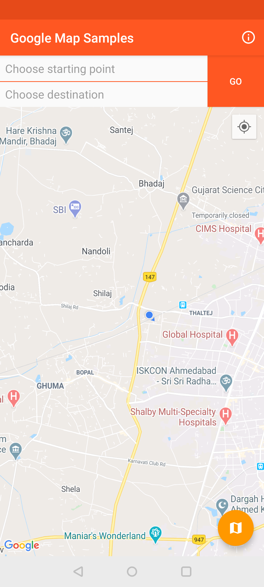
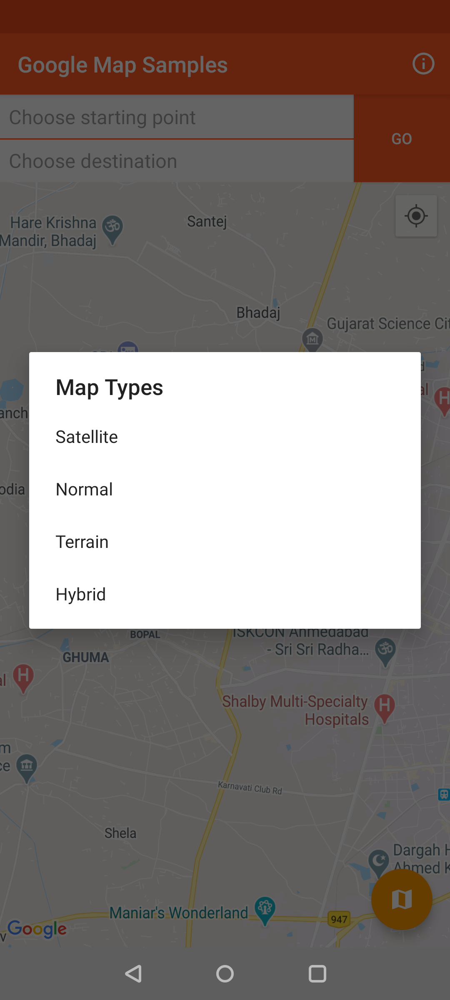

# Google Maps Samples 

[](https://travis-ci.org/krunal3kapadiya/Google-Maps-Samples)


[](https://twitter.com/krunal3kapadiya)
[](https://medium.com/@krunal3kapadiya)
[](https://www.facebook.com/krunal3kapadiya)


Google Maps Samples is created to use the google maps feature very quickly.  
All basic implementation used for map are at one place and handy to use.

> Click this [ROUTING_MAP](ROUTING_MAP.md) file to see how you can route in your emulator.

Get the [apk](misc/google_map_sample.apk) here.

What you will find in this repositories?

### Location updates
#### 1. Getting last known location
```
LocationServices.getFusedLocationProviderClient(this).lastLocation
        .addOnSuccessListener { location: Location? ->
            // Got last known location. In some rare situations this can be null.
            location?.let {
                map?.moveCamera(CameraUpdateFactory.newLatLngZoom(LatLng(location.latitude, location.longitude), 14F))
            }
        }
```
### Search Places

> IN PROGRESS

### Getting different types of maps
```
map?.mapType = GoogleMap.MAP_TYPE_SATELLITE
map?.mapType = GoogleMap.MAP_TYPE_NORMAL
map?.mapType = GoogleMap.MAP_TYPE_TERRAIN
map?.mapType = GoogleMap.MAP_TYPE_HYBRID
```
### From LatLang get the address in the map
```
val address = Geocoder(this, Locale.getDefault()).getFromLocation(location.latitude, location.longitude, 1)
```

### Get the distance between two LatLang

```
val results = FloatArray(1)
Location.distanceBetween(
    firstLocation.latitude, firstLocation.longitude,
    secondLocation.latitude, secondLocation.longitude, results
)
// results[0] results in meter
```

## Screenshots
|S1|S2|S3|
|:---:|:---:|:---:|
||||


## What you can contribute?
- Any features related to Google Maps.

## Contributing guidelines?
- Add features and commit with it.
- Update README with screenshot, APK and code snippet.
- Create pull request for it.

## Licence
    Copyright 2018 Krunal Kapadiya

    Licensed under the Apache License, Version 2.0 (the "License");
    you may not use this file except in compliance with the License.
    You may obtain a copy of the License at

       http://www.apache.org/licenses/LICENSE-2.0

    Unless required by applicable law or agreed to in writing, software
    distributed under the License is distributed on an "AS IS" BASIS,
    WITHOUT WARRANTIES OR CONDITIONS OF ANY KIND, either express or implied.
    See the License for the specific language governing permissions and
    limitations under the License.
