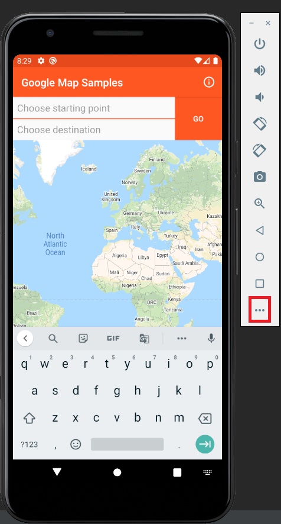
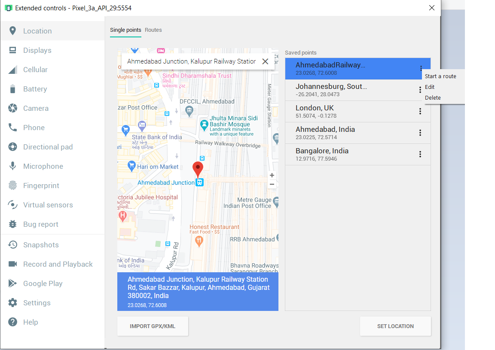
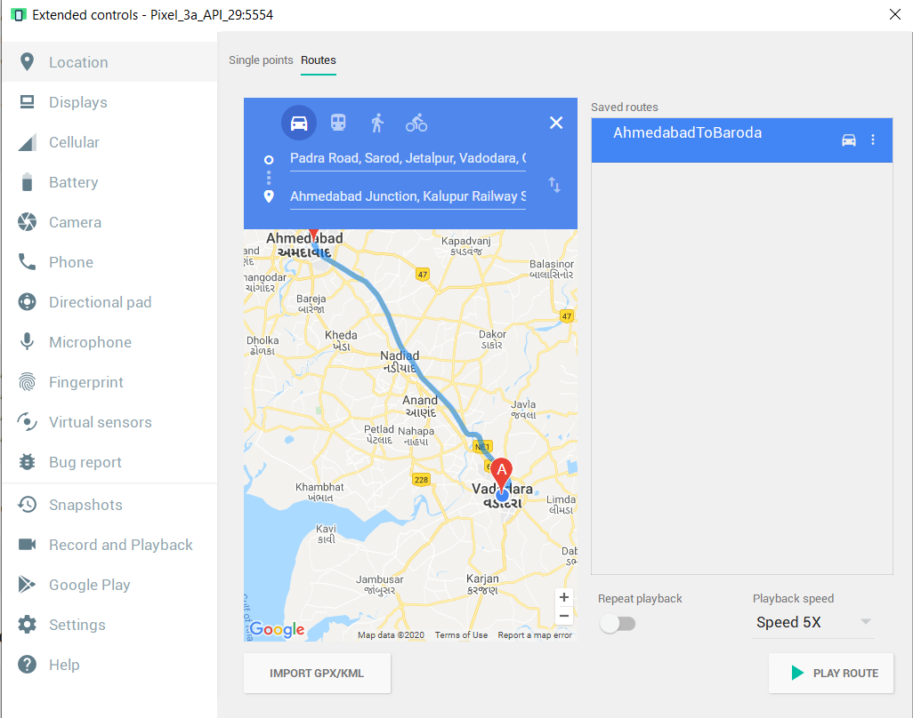

# Routing Map location in Emulator.

You are always looking for GPX or KML file to use Google Maps Routing in Android.

|Step 1|Step 2|
|:---:|:---:|
|||
|Click the red icon|Search starting location|

|Step 3|Step 4|
|:---:|:---:|
||
|Save the name0|Start the route|

You will moving in your application with the selected speed.